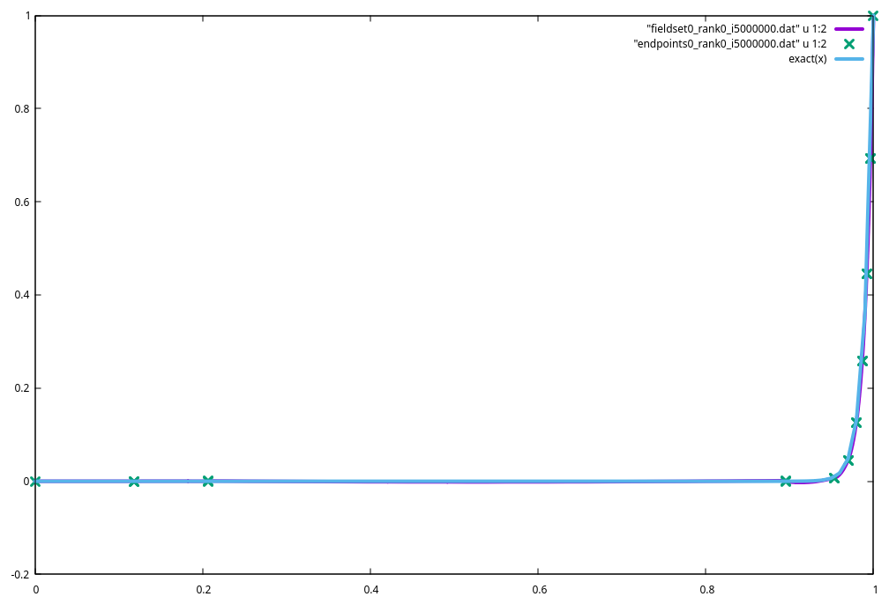

API
===

===============
Transformations
===============
Transformations are responsible for taking coordinates from a reference domain to a physical domain.
We denote the Physical domain with :math:`\Omega` and the reference domain with :math:`\hat\Omega`. 
Similarly the physical domain of a given element is notated :math:`\mathcal{K}` 
and the reference element domain with :math:`\hat{\mathcal{K}}`

==================
Geometric Entities
==================
There are two primary abstractions iceicle defines for geometric entities used in finite element computations:
:cpp:class:`iceicle::ElementTransformation`, which represents the physical domain transfromation in :math:`\mathbb{R}^d`, and 
:cpp:class:`iceicle::Face`, which represents the physical domain of the intersection of two domains with their respective element transformations.

---------------------------------
Element Coordinate Transformation
---------------------------------

:cpp:class:`iceicle::ElementTransformation` is a function table that represents
the transformation :math:`T:\mathbf{\xi}\mapsto\mathbf{x}`
from a reference domain :math:`\hat{\mathcal{K}} \subset \mathbb{R}^d` 
to the physical domain :math:`\mathcal{K} \subset \mathbb{R}^d` 
where :math:`\mathbf{\xi}\in\hat{\mathcal{K}}, \mathbf{x}\in\mathcal{K}`. 
The degrees of freedom that define the physical domain are termed "nodes".
:cpp:class:`iceicle::ElementTransformation` operates directly on node coordinates (``std::span<Point>``), 
however, in general the coordinates are stored in a large :cpp:type:`iceicle::NodeArray`, 
and the connectivity of node indices in this array for each element is stored separately.

:cpp:class:`iceicle::ElementTransformation` requires a utility function :cpp:member:`iceicle::ElementTransformation::get_el_coord`
to get the element local coordinates from the global coordinate array and the list of node indices.

:cpp:member:`iceicle::ElementTransformation::transform` represents the transformation :math:`T`

:cpp:member:`iceicle::ElementTransformation::Jacobian` represents the Jacobian of the transformation :math:`\mathbf{J} = \frac{\partial T}{\partial \mathbf{\xi}}`, 
alternatively :math:`\mathbf{J}` can be written as :math:`\frac{\partial \mathbf{x}}{\partial \mathbf{\xi}}`.

:cpp:member:`iceicle::ElementTransformation::Hessian` represents the hessian of the transformation 
:math:`\mathbf{H} =\frac{\partial^2 T}{\partial \mathbf{\xi}\partial \mathbf{\xi}}` or :math:`\frac{\partial \mathbf{x}}{\partial \mathbf{\xi}\partial \mathbf{\xi}}`.

.. tikz:: Element Transformation
   :libs: arrows

   \path[shape=circle]
   (-1,-1) node[draw,scale=0.5](a1){}
   ( 1,-1) node[draw,scale=0.5](a2){}
   ( 1, 1) node[draw,scale=0.5](a3){}
   (-1, 1) node[draw,scale=0.5](a4){};
   \draw[thick] (a1) -- (a2) -- (a3) -- (a4) -- (a1);

   \draw[->] (-2,-1.5) -- (-1.5,-1.5) node[anchor=west, scale=0.7]{$\xi$};
   \draw[->] (-2,-1.5) -- (-2.0,-1.0) node[anchor=south, scale=0.7]{$\eta$};

   \draw[->, thick] (1.5, 0.0) -- (3.0, 0.0);

   \path[shape=circle]
   (4.0,-1) node[draw,scale=0.5](b1){}
   ( 5.8,-0.7) node[draw,scale=0.5](b2){}
   ( 6.0, 0.9) node[draw,scale=0.5](b3){}
   (4.2, 1.1) node[draw,scale=0.5](b4){};
   \draw[thick] (b1) -- (b2) -- (b3) -- (b4) -- (b1);

   \draw[->] (3.0,-1.5) -- (3.5,-1.5) node[anchor=west, scale=0.7]{$x$};
   \draw[->] (3.0,-1.5) -- (3.0,-1.0) node[anchor=south, scale=0.7]{$y$};

.. doxygenstruct:: iceicle::ElementTransformation
   :members:

------------------
Domain Definitions
------------------

Domains are specified by the domain type and polynomial order of basis functions for the nodes, accesible through 
:cpp:member:`iceicle::ReferenceElement::domain_type` and :cpp:member:`iceicle::ReferenceElement::geometry_order` respectively.

------
Faces
------
In the physical domain :math:`\Omega \subset \mathbb{R}^d` consider two non-overlapping elements :math:`\mathcal{K}^L \subset \Omega` and :math:`\mathcal{K}^R \subset \Omega` 
with boundaries :math:`\partial\mathcal{K}^L` and :math:`\partial\mathcal{K}^R` respectively. 
A face is the non-empty intersection of the face boundaries :math:`\Gamma = \partial\mathcal{K}^L \cap \partial \mathcal{K}^R`.

.. tikz:: Face 
  
   \draw[thick] (0.0, 0.0) -- (1.0, 0.0) -- (1.3, 1.5) -- (0.0, 1.0) -- (0.0, 0.0);
   \draw[thick] (1.0, 0.0) -- (1.3, 1.5) -- (2.5, 0.0) -- (1.0, 0.0);

   \node at (0.5, 0.5) []{$\mathcal{K}^L$};
   \node at (1.5, 0.5) []{$\mathcal{K}^R$};

   \draw[very thick, blue] (1.0, 0.0) -- (1.3, 1.5);
   \node at (1.0, 1.0) [blue]{$\Gamma$};

This forms a :math:`d-1` dimensional manifold in the physical domain. 
Similar to elements, a reference domain is used to create simple and consistent integration on faces.
The reference face is denoted with :math:`\hat{\Gamma}`.
The reference face is defined on a :math:`d - 1` dimensional domain (:math:`\hat{\Gamma}\subset \mathbb{R}^{d-1}`).

For coordinates in the reference domain :math:`\mathbf{s} \in \hat{\Gamma}` we define transformations to the physical domain and the reference domains 
of the left and right elements.

Physical Domain Transformation 
-------------------------------

Denote the transformation from the face reference domain to the physical domain by 

.. math::
   T_f : \mathbf{s} \mapsto \mathbf{x}

such that the face normal vector (defined later) is outward for the left element at all points along the manifold :math:`\Gamma` 
(i.e points from the left element to the right element).

The physical domain transformation is implemented in:

.. doxygenfunction:: iceicle::Face::transform
   :no-link:

The face Jacobian refers to the Jacobian of this transformation:

.. math::
   J^{fac} = \frac{\partial x_i}{\partial s_j} = \frac{\partial T_{f, i}(\mathbf{s})}{\partial s_j}

This is implemented in:

.. doxygenfunction:: iceicle::Face::Jacobian
   :no-link:

The Riemannan metric tensor for the manifold :math:`\Gamma` is :math:`g_{kl}`

.. math::

   g_{kl} = \sum_i \frac{\partial x_i}{\partial s_k}\frac{\partial x_i}{\partial s_l}

The Riemannian metric tensor can be calculated by providing the face jacobian to:

.. doxygenfunction:: iceicle::Face::RiemannianMetric
   :no-link:

Reference Domain Transformations 
--------------------------------

It can also be important to know the location in the corresponding element reference domains as a result of the transformation. 
Thus we define :math:`T_{\xi_L} : \mathbf{s} \mapsto \mathbf{\xi}_L` where :math:`\mathbf{\xi}_L \in \hat{\Omega}_L` for the transformation 
to the left element reference domain, and the same :math:`T_{\xi_R}` for the respective right element.

This must be defined such that for the element transformation :math:`T_L : \mathbf{\xi}_L \mapsto \mathbf{x}` the transformation 
remains consistent with the physical domain transformation of the face.

.. math::
   T_f(\mathbf{s}) = T_L(T_{\xi_L}(\mathbf{s}))

The same holds for the right element. The different transformations can be diagrammed as: 

.. tikz:: Transformation Paths
   :libs: arrows

   \node (A) at (2.0, 0.0) {$\mathbf{s}$};
   \node (B) at (0.0, 2.0) {$\mathbf{\xi}_L$};
   \node (C) at (4.0, 2.0) {$\mathbf{\xi}_R$};
   \node (D) at (2.0, 4.0) {$\mathbf{x}$};
   \draw[->] (A) -- (B) node[midway, below left] {$T_{\xi_L}$};
   \draw[->] (A) -- (C) node[midway, below right] {$T_{\xi_R}$};
   \draw[->] (B) -- (D) node[midway, above left] {$T_{L}$};
   \draw[->] (C) -- (D) node[midway, above right] {$T_{R}$};
   \draw[->] (A) -- (D) node[midway, right] {$T_{f}$};

:math:`T_{\xi_L}` and :math:`T_{\xi_R}` are implemented respectively in 

.. doxygenfunction:: iceicle::Face::transform_xiL
   :no-link:
.. doxygenfunction:: iceicle::Face::transform_xiR
   :no-link:

The reference domain transformations can be uniquely defined by knowing the domain type of the left and right element, 
the face number (a number for each face in the reference domain) for the left and right element, and the orientation 
for the left and right element. We choose the orientation of the left element to always be the orientation 0. 

This admits another decomposition for the reference domain transformations: we take the canonical reference domain transformation 
to be the left reference domain transformation (:math:`T_\xi := T_{\xi_L}`) and define an orientation transformation :math:`T_{orient}: \mathbf{s} \mapsto \mathbf{s}_R`.
Then we can compose the right transformation out of the orientation transformation and canonical reference domain transformation.

.. math::
   T_{\xi_R} = T_\xi(T_{orient}(\mathbf{s}))

Note that :math:`T_\xi` is dependent on face number, so when calculating :math:`T_{\xi_R}` we still pass the face number for the right element.

In this case the diagram becomes:

.. tikz:: Transformation Paths with Orientation
   :libs: arrows

   \node (A) at (2.0, 0.0) {$\mathbf{s}$};
   \node (A1) at (4.0, 0.0) {$\mathbf{s}_R$};
   \node (B) at (0.0, 2.0) {$\mathbf{\xi}_L$};
   \node (C) at (4.0, 2.0) {$\mathbf{\xi}_R$};
   \node (D) at (2.0, 4.0) {$\mathbf{x}$};
   \draw[->] (A) -- (B) node[midway, below left] {$T_{\xi}$};
   \draw[->] (A) -- (A1) node[midway, below] {$T_{orient}$};
   \draw[->] (A1) -- (C) node[midway, right] {$T_{\xi}$};
   \draw[->] (B) -- (D) node[midway, above left] {$T_{L}$};
   \draw[->] (C) -- (D) node[midway, above right] {$T_{R}$};
   \draw[->] (A) -- (D) node[midway, right] {$T_{f}$};

The external interface of the :cpp:class:`iceicle::Face` only sees :math:`T_{\xi_L}` and :math:`T_{\xi_R}` but 
often for internal implementation this decomposition is used internally for ease of implementation.

Face Normal Vector 
------------------

The face normal vector is computed and oriented by the 1-vector that is obtained by applying the hodge star operator 
to the wedge product of the columns of the face Jacobian. Denote the columns of the face Jacobian by :math:`J^{fac} = \begin{bmatrix} J^{fac}_{\cdot 1} & \dots & J^{fac}_{\cdot (d-1)}\end{bmatrix}`

.. math::
   \mathbf{n} = \star (J^{fac}_{\cdot 1} \wedge \dots \wedge J^{fac}_{\cdot (d-1)})

Note that in 3 dimensions this is just the cross product of the two columns.

This operation is done with ``NUMTOOL::TENSOR::FIXED_SIZE::calc_ortho``.

Boundary Conditions 
-------------------

Faces also store information related to boundary conditions to apply at the face. 
This comes in the form of a :cpp:enum:`iceicle::BOUNDARY_CONDITIONS` 
and an integer flag for the boundary condition.
Interior faces are marked with :cpp:enumerator:`iceicle::BOUNDARY_CONDITIONS::INTERIOR`.

.. doxygenenum:: iceicle::BOUNDARY_CONDITIONS

---------------
Face Generation
---------------

To uniquely define the transformation operations that a face needs to perform we need 

* the face domain type for :math:`T_f`

* the domain type of the left element for :math:`T_{\xi_L}`

* the domain type of the right element for :math:`T_{\xi_R}`

   For boundary faces this is the same as the left element with the exception of :cpp:enumerator:`iceicle::BOUNDARY_CONDITIONS::PARALLEL_COM`
   Details are given below

* the geometry polynomial order for the face: 

   For the intersection of two elements with different polynomial order for geometry, 
   we choose the minimum of the two, so that the geometry can be consistent. 
   The nodes of the high order element must be chosen such that the manifold is consistent 
   with the low order element.

* the element index for the left element 

* the element index for the right element 

* the indices of the nodes on the face to calculate :math:`T_f` in order such that :math:`T_f` is consistent with :math:`T_L(T_{\xi_L})`

* the face number for the left element 

* the face number for the right element 

* the orientation of the face wrt the right element 

* the boundary condition type 

* the boundary condition flag

:code:`face_utils.hpp` contains a utility :cpp:func:`make_face` 
to generate faces by finding the intersection between two elements.

.. code-block:: cpp 
   :linenos:

   // get a hypercube element transformation of polynomial order 1
   int order = 1;
   auto el_transformation = ElementTransformationTable<double, int, 2>::get_transform(
      DOMAIN_TYPE::HYPERCUBE, order)

   // connectivities
   std::vector<int> el0_nodes{{0, 1, 2, 3}};
   std::vector<int> el2_nodes{{2, 3, 4, 5}};

   // find and make the face with vertices {2, 3}
   auto face_opt = make_face(0, 2, el_transformation, el_transformation, el0_nodes, el2_nodes);

   // unique_ptr to face is stored in the value() of optional
   std::unique_ptr<Face<double, int, 2>> face{std::move(face_opt.value())}; 

This can detect elements with different geometric polynomial orders because this operates on vertices.
The polynomial order of the face geometry is the minimum of the two element polynomial orders.

===============
Basis Functions
===============

The function spaces considered are discretized by a discrete set of functions :math:`\{\phi_i\}` that span a subset of the full space. 
These functions are called the basis functions as they form a bases for this discretized space. 
Any solution in this discretized space can be formed by a linear combination of coefficients and these basis functions:

.. math::
   
   u(\mathbf{x}) = \sum_i a_i \phi_i(\mathbf{x})

By Galerkin Orthogonality, weak forms enforced with this discrete set of basis functions give the best approximation 
in the discretized space of the solution over the full space with respect to the energy norm.

The :cpp:class:`iceicle::Basis` class is the interface used for Basis functions. 
This provides an interface to evaluate basis functions, gradients with respect to reference domain coordinates, and hessians with respect to reference domain coordinates. 
The interface also provides information such as the number of basis functions (:cpp:func:`iceicle::Basis::nbasis`),
reference domain type (:cpp:func:`iceicle::Basis::domain_type`), flags for orthonormality, and nodal basis, and the polynomial order.

Currently implemented:

- Lagrange polynomials on hypercube domains (:cpp:class:`iceicle::HypercubeLagrangeBasis`) and simplex domains (:cpp:class:`iceicle::SimplexLagrangeBasis`). 
   These are implemented with compile time constants for polynomial order up to ``FESPACE_BUILD_PN`` in ``build_config.hpp``.

- Legendre polynomials on hypercube domains up to 10th order (:cpp:class:`iceicle::HypercubeLegendreBasis`).

.. doxygenclass:: iceicle::Basis
   :members:

.. doxygenclass:: iceicle::HypercubeLagrangeBasis

.. doxygenclass:: iceicle::HypercubeLegendreBasis

.. doxygenclass:: iceicle::SimplexLagrangeBasis

===========
Dof Mapping
===========
The mapping of degrees of freedom from indices local to an element to global arrays
is an important and delicate construction. 
The ultimate goal is to be able to represent this mapping for all elements throughout the De Rham complex. 
This is captured by the concept of conformity classes.
Different spaces in the De Rham complex have different requirements on the conformity of degrees of freedom. 
The conformity is an integer representing the position in the exact sequence 
formed by starting with the :math:`H^1` space under the exterior derivative.
If ``conformity == ndim`` the elements are :math:`L^2` and there are no conforming 
dofs between elements.
Implementation-wise, dofs with any amount of conformity are mapped with a 
compressed-row storage matrix which maps the pair ``[iel, ildof]`` to ``gdof``.
Where ``iel`` is the element index, ``ildof`` is the local index of the dof on the 
element domain, and ``gdof`` is the global degree of freedom index.
:math:`L^2` elements on the other hand, do not need this, and use an array that 
contains the offsets generated by concatenating the local degrees of freedom for each element.

Generating local basis function indexing and mapping 
for all conformity classes is future work. 
Right now the node connectivity array is the only conformity mapping generated.

-----------------
Parallel Indexing
-----------------
The :cpp:struct:`pindex_map` serves to represent the mapping from process local indices to 
a index set over all the processes. This provides a direct array mapping for process local indices to 
parallel indices and a hashmap for the reverse mapping. This also introduces the concept of **ownership**.
Different processes may have access and map to the same parallel index, but only one "owns" that index.
These owned indices are contiguous index sets in order of mpi rank. This makes it cheap to query ownership.

.. doxygenstruct:: iceicle::pindex_map
   :members:

-----------------------------
Parallel Element Partitioning
-----------------------------
Elements can be partitioned amoung the mpi ranks using METIS or a naive partitioning that
evenly splits the element indices. Owned elements are the elements assigned to the rank by the partitioning.
Each rank also has "ghost"" elements: currently assigned as interprocess face neighboring elements.

So the element indices decompose as:

.. tikz:: Element Partitioning
   :libs: shapes, matrix

   \matrix[row sep=0mm, column sep=1mm] {
      \node[draw, minimum height=1em, minimum width = 14cm] {owned elements}; &
      \node[draw, minimum height=1em, minimum width = 6cm] {ghost elements}; \\
   };

-------------------------
Parallel Dof Partitioning 
-------------------------
To prevent confusion we introduce another naming for degrees of freedom.
A parallel degree of freedom or ``pdof`` is the index of a dof that is unique over all mpi ranks.
We will map pdofs to gdofs which are local to each mpi rank.

When running in parallel there will be degrees of freedom that are shared in different ways between processes.
We use the concept of **ownership** to deal with this.
Each parallel degree of freedom will have one owning process. 
Each rank will own a contiguous range of pdofs.

The pdofs to gdof mapping is stored in a :cpp:struct:`iceicle::pindex_map`. 

Note that gdofs are ordered into three disjoint, contiguous subranges.
First are the gdofs corresponding to pdofs that are owned by this rank.
Next come gdofs corresponding to pdofs on elements owned by this rank.
Finally are gdofs corresponding to pdofs on "ghost" elements.

.. tikz:: pdof Ordering
   :libs: shapes, matrix

   \matrix[row sep=0mm, column sep=1mm] {
      \node[draw, minimum height=1em, minimum width = 14cm] {owned gdofs}; &
      \node[draw, minimum height=1em, minimum width = 4cm] {shared gdofs}; &
      \node[draw, minimum height=1em] {ghost gdofs}; \\
   };

..
   ----------------------
   FaceGeoDofConnectivity
   ----------------------
   This class keeps node indices for a face and connected elements 
   The best use of this class is to loop over face dofs, then left dofs, then right dofs.
   The ``dofs`` array is defined as follows
   ``[0, nfaces)`` will have ``gdof``, ``trace_dof``, ``left_dof``, and ``right_dof`` defined 
   where ``gdof`` is the node index in the mesh and the other are local indices to the respective domains. 
   Then ``[nfaces, nfaces + elL.n_nodes())`` has ``gdof`` and ``left_dof`` defined (others are -1).
   And the rest is the right dofs.

================
Quadrature Rules 
================

Quadrature rules approximate the integral of a function :math:`f` over a given domain by a linear combination of weights :math:`w_i` 
with the function evaluated at specified points :math:`x_i`

.. math::

   \int_a^b f(x)\; dx \approx \sum_{i=1}^{n_q} w_i f(x_i)

Where :math:`n_q` is the number of quadrature points in the quadrature rule. 
Often there are theoretical results pretaining to the accuracy of certain quadrature rules which can be used to determine the number of quadrature points required.
Quadrature rules are implemented to specify points in the reference domain, as most rules are defined in the reference domain to be able to specify the points.
Currently implemented are:

- Gauss-Legendre Quadrature on Hypercube domains (:cpp:class:`HypercubeGaussLegendre`). 
   The ``npoin`` parameter refers to the number of quadrature points in one dimension. 
   This can exactly integrate polynomials of order ``2 * npoin - 1``.

- Grundmann-Moller transformation of Gauss-Legendre quadrature for simplex domains (:cpp:class:`GrundmannMollerSimplexQuadrature`)
   The ``order`` parameter refers to the order of the integrating polynomial (parameter :math:`s` in Grundmann and Moller [GrundmannMoller1978]_)
   This can exactly integrate polynomials of order ``2 * order + 1``.

==============
Finite Element
==============

==========
Data Views
==========

There are several view types for multidimensional data - inspired by :cpp:class:`std::mdspan`. 
The multidimensional data is indexed by finite-element specific terms.
A **degree of freedom** in ICEicle represents a basis function in the finite element space. 
These functions may take vector valued inputs and have vector valued outputs which are indexed by **vector component**.
For example, a node in 3D can be viewed as a geometric degree of freedom, with vector components for the x, y, and z positions.
Often coefficients are defined for each vector component - some other implementations may refer to this as a degree of freedom.

------
fespan 
------
This is the primary data view type.
This represents the mapping of the degrees of freedom of a finite element space. 

The `LayoutPolicy` represents two mappings that are critical for the functioning of the 
:cpp:class:`iceicle::fespan`.
This first maps an element index ``ielem``, a element-local degree of freedom index ``idof``,
and a vector component index ``iv`` to an index in the view.
The second maps a global degree of freedom index ``igdof``, and a vector component index ``iv`` 
to an index in the view.

The `LayoutPolicy` should also provide some parallel index information, which can be 
delegated to a :cpp:struct:`iceicle::pindex_map`. 
Some functionality depends on the inclusion of indices that map in different ways to parallel indices.
For example, if the view includes ghost degrees of freedom, then writing to that index wouldn't 
update the data value on the owned process and cause contradictory values.
So write operations that are not communication aware are disabled.

The `AccessorPolicy` represents how to access the data. 
Right now, we only support the standard accessor that effectively acts as a pointer dereference at 
the offset given by the `LayoutPolicy`

.. doxygenclass:: iceicle::fespan 
   :members:

-----------
geo_dof_map
-----------

The struct :cpp:struct:`iceicle::geo_dof_map` represents a mapping to a subset of geometric (nodal) degrees of freedom

-------------
geo_param_map
-------------
Maps a geometric parameterization

--------------
component_span
--------------
:cpp:class:`iceicle::component_span` represents a view over a subset of vector components.
Each degree of freedom (``idof``) and vector component (``idof``) index maps to an index in a one dimensional array.
This mapping is controlled by the :cpp:class:`LayoutPolicy`.

===============
Discretizations
===============

----------
Projection
----------
The Projection discretization is a linear form to project a function onto the space. 
The strong form of the equation is:

.. math::

   \mathbf{U} = \mathbf{f}(\mathbf{x})

with a weak form 

.. math::
   
   \int_\mathcal{K} \mathbf{U} v \; d\mathcal{K} = \int_\mathcal{K} \mathbf{f}(\mathbf{x}) v \; d\mathcal{K}

The right hand side of this equation is represented by :cpp:func:`iceicle::Projection::domain_integral()`.
Projections take a :cpp:type:`iceicle::ProjectionFunction` to represent the function :math:`\mathbf{f}`.

============
Spacetime DG
============

In ICEicle, Space-time DG is ostensibly treated as any other DG problem, with the last dimension representing the time dimension.
Discretizations take this into account and implement fluxes such that the last dimension is the time dimension. 
Consider a general conservation law as generally described with space and time derivatives separate:

.. math:: 

   \frac{\partial \mathbf{U}}{\partial t} + \frac{\partial \mathbf{F}_j(\mathbf{U})}{\partial x_j} = 0

Let :math:`\Omega_x \subset \mathbb{R}^d` represent the spatial domain, and :math:`\Omega_t \subset \mathbb{R}` represent the time domain. 
:math:`d` is the number of spatial dimensions
This conseration law can be rewritten in the combined space-time domain :math:`\Omega = \Omega_x \times \Omega_t`.

.. math::

   \nabla\cdot\mathcal{F} = 0

Where:

.. math:: 

   \nabla = \begin{pmatrix} \frac{\partial}{\partial x_1} & ... & \frac{\partial}{\partial x_d} & \frac{\partial}{\partial t} \end{pmatrix}^T

   \mathcal{F} = \begin{pmatrix} \mathbf{F}_1 & ... &\mathbf{F}_d & \mathbf{U} \end{pmatrix}^T

Interior fluxes and domain integrals just need to take this formulation into account in their implemenation. 
For the boundary, this results in two new boundary conditions.

The :cpp:enumerator:`iceicle::BOUNDARY_CONDITIONS::SPACETIME_FUTURE` represents the boundary with the future of the solution. Due to the nature of time 
this flux has to be purely upwind, so this is effectively equivalent to the :cpp:enumerator:`iceicle::BOUNDARY_CONDITIONS::EXTRAPOLATION` boundary condition.

The :cpp:enumerator:`iceicle::BOUNDARY_CONDITIONS::SPACETIME_PAST` represents the boundary with the past of the solution. Some implementations choose to do this 
as a Dirichlet boundary condition. However, since we want to process slabs of spacetime this is implemented by referencing 
another solution and the :code`fespace` it is defined on (which can be different). 

The first step is to find the node connectivity with :cpp:func:`iceicle::compute_st_node_connectivity`.
This takes two meshes in spacetime, ignores the time dimension and matches up nodes based on the boundary conditions 
and physical domain location. The resulting map when given a key of a node index in the current mesh,
will return the corresponding key in the "past" (connected) mesh.

.. code-block:: cpp 
   :linenos:

   using namespace iceicle;
   AbstractMesh<double, int, ndim> past_mesh{/* ... */};
   AbstractMesh<double, int, ndim> current_mesh{/* ... */};
   std::map<int, int> st_conn = compute_st_node_connectivity(past_mesh, current_mesh);

   int inode_past = st_conn[inode_curr]; 

The next step is to 

This also allows setting an initial condition by projecting the desired initial condition and using that as the past solution.

For example, using a sine wave as an initial condition.

.. code-block:: cpp
   :linenos:

   using namespace iceicle;

   // 1 dim space + 1 dim time
   static constexpr int ndim = 2;

   // lambda for the sine function
   ProjectionFunction<double, ndim, 1> func = {
      out[0] = std::sin(x[0]);
   }

   // create the FESpace
   FESpace<double, int, ndim> fespace{/* ... */};

   std::map<int, int> node_connectivity = compute_st_node_connectivity(fespace.meshptr, fespace.meshptr);

Note that since the ``x`` argument is just a pointer, initial conditions designed for just the spatial dimensions 
wil have no issue being used to initilize a time-slab.

=======
Solvers
=======

------------
Gauss-Newton
------------

:cpp:class:`iceicle::solvers::CorriganLM` is a nonlinear optimization solver. 
This uses a regularized version of the Gauss-Newton method (can be seen as a hybrid between Gauss-Newton and Levenberg-Marquardt) 
with linesearch.
In each nonlinear iteration, it solves the following subproblem:

.. math::

   \Big(\mathbf{J}^T \mathbf{J} + \mathcal{R}\Big)\pmb{p} = -\mathbf{J}^T \pmb{r}

and then performs a linesearch in the direction :math:`\pmb{p}` to minimize :math:`\pmb{r}`. 
This can be viewed as Newton's method on the least squares problem using :math:`\mathbf{J}^T\mathbf{J}` as the Hessian approximation.
:math:`\mathcal{R}` is a regularization matrix, assumed to be symmetric positive definite.

Petsc is used for matrix operations.

==================================================================
Moving Discontinuous Galerkin with Interface Condition Enforcement
==================================================================

Moving Discontinuous Galerkin with Interface Condition Enforcement or (MDG-ICE) is implemented using a continuous 
variational formulation.

The first step of the algorithm is to select degrees of freedom to consider.
We employ a selection threshold to allow the user to eliminate degrees of freedom
where the interface conservation is enforced to a satisfactory level.

.. code::

   selected_traces = []
   for trace in internal_traces and boundary_traces:
      ic := interface conservation(u, trace, trace.centroid)
      if norm(ic) > threshold:
         selected_traces.append(trace)

The geometry degrees of freedom are all the nodes in the selected traces parameterized by geometry restrictions
(i.e nodes can only slide along boundary)

-----------
Boundary IC
-----------

Note: these are currently not implemented

The interface conservation (IC) on the boundary requires some special care. 
Dirichlet-type boundary conditions will draw the exterior state from the Dirichlet boundary condition, 
thus creating a left and right state at the evaluation point on the trace to get the IC residual.

Extrapolation and Neumann type boundary conditions assume no jump in state, therefore the interface 
conservation for convective fluxes is automatically satisfied. 
Neumann type boundary conditions, however, may still have a jump in gradient, so the IC evaluation will 
need to treat the diffusive terms separately.

Numerical Studies
=================

Some numerical studies are presented to show investigation into MDG-ICE and validate the implementation of ICEicle.

=========================
1D Boundary Layer Problem
=========================

This is the first test problem presented in Kercher et al. [Kercher2021]_. 
This steady-state linear advection-diffsuion problem mimics a boundary layer by creating a large solution gradient near the 
boundary. 
Underresolving this flow feature will result in oscillations with high order DG approximations.
The model equation is:

.. math::

   &a\frac{\partial u}{\partial x} -\mu \frac{\partial^2 u}{\partial x^2} = 0 \quad x\in (0, 1) \\
   &u(0) = 0 \\
   &u(1) = 1

The Peclet number :math:`\text{Pe} = \frac{al}{\mu}` nondimensionalizes the equation. The tests are run with a Peclet number of 100. The exact solution is:

.. math::

   u(x) = \frac{1 - \text{exp}(x\cdot\text{Pe})}{1 - \text{exp}(\text{Pe})}

A current best result with DGP2 solution approximation and P1 geometry can be achieved with the following input file:

.. code-block:: lua 
   :linenos:

   local mu_arg = 0.01
   local v_arg = 1.0
   local l = 1.0
   local Pe = v_arg / mu_arg / l

   return {
      -- specify the number of dimensions (REQUIRED)
      ndim = 1,

      -- create a uniform mesh
      uniform_mesh = {
         nelem = { 10 },
         bounding_box = {
               min = { 0.0 },
               max = { l },
         },
         -- set boundary conditions
         boundary_conditions = {
               -- the boundary condition types
               -- in order of direction and side
               types = {
                  "dirichlet", -- left side
                  "dirichlet", -- right side
               },

               -- the boundary condition flags
               -- used to identify user defined state
               flags = {
                  0, -- left
                  1, -- right
               },
         },
         geometry_order = 1,
      },

      -- define the finite element domain
      fespace = {
         -- the basis function type (optional: default = lagrange)
         basis = "lagrange",

         -- the quadrature type (optional: default = gauss)
         quadrature = "gauss",

         -- the basis function order
         order = 2,
      },

      -- describe the conservation law
      conservation_law = {
         -- the name of the conservation law being solved
         name = "burgers",
         mu = 0.01,
         a_adv = { 1.0 },
         b_adv = { 0.0 },
      },

      -- initial condition
      initial_condition = function(x)
         return (1 - math.exp(x * Pe)) / (1 - math.exp(Pe))
      end,

      -- boundary conditions
      boundary_conditions = {
         dirichlet = {
               0.0,
               1.0,
         },
      },

      -- MDG
      mdg = {
         ncycles = 1,
         ic_selection_threshold = function(icycle)
               return 0.0
         end,
      },

      -- solver
      solver = {
         type = "gauss-newton",
         form_subproblem_mat = true,
         linesearch = {
               type = "corrigan",
         },
         lambda_b = 1e-8,
         lambda_lag = 0.1,
         lambda_u = 1e-20,
         ivis = 10000,
         tau_abs = 1e-10,
         tau_rel = 0,
         kmax = 5000000,
      },

      -- output
      output = {
         writer = "dat",
      },
   }

==========
References
==========
.. [Kercher2021] Kercher, A. D., Corrigan, A., & Kessler, D. A. (2021). The moving discontinuous Galerkin finite element method with interface condition enforcement for compressible viscous flows. International Journal for Numerical Methods in Fluids, 93(5), 1490-1519.

.. [Arnold2000]  Arnold, D. N., Brezzi, F., Cockburn, B., & Marini, D. (2000). Discontinuous Galerkin methods for elliptic problems. In Discontinuous Galerkin Methods: Theory, Computation and Applications (pp. 89-101). Berlin, Heidelberg: Springer Berlin Heidelberg.

.. [GrundmannMoller1978] Grundmann, A., & Möller, H. M. (1978). Invariant integration formulas for the n-simplex by combinatorial methods. SIAM Journal on Numerical Analysis, 15(2), 282-290.
